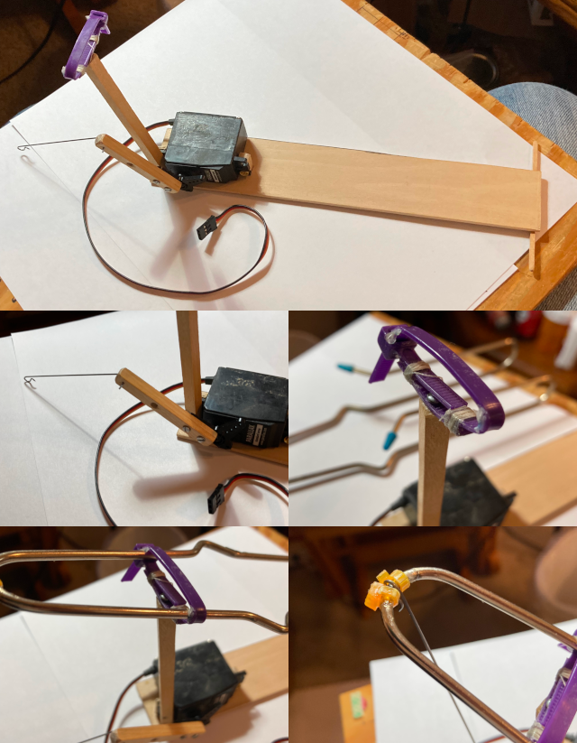

<!--  -->

# An Arduino controlled Wheel-O

## Overview

So I've had a Wheel-O and a large servo set aside for a long time and I knew that one day they had to be a project. So here is the list of steps I took to put a Wheel-O under the control of an Arduino Nano.

## The Base

* I made a flat base platform with a stand that acted as a pivot for the wheel-o handle. I used a zip-tie to hold the wheel-o handle and put a small screw through the zip-tie to mount it securely on the top of a balsa wood stand.
* I mounted the servo on the base right next to the stick that the handle of the wheel-o is mounted on.
* I added a 2-3 inch piece of hardwood to the servo horn to extend the leverage a small amount.
* I added a piece of steel wire between the back end of the wheel-o handle and the end of the lever on the servo horn.

With that in place you are all set to start using the servo to push and pull on the handle of the wheel-o and put everything under the control of your Arduino. 😎

Power Considerations: Note that depending on the amount of current pulled by the servo you will most likely want to use two power sources for this project: one just for the servo and one to power your Arduino (like using the USB cable). I was able to power mine using just the USB cable plugged into a powered USB hub but your mileage may vary. You might need a separate battery or other source just for the power to the servo. If you do use an additional power source just for the servo be sure to connect the ground of the additional power to the ground of Arduino.

## The Code

I love to code in any language and I'm always overly optimistic on how easy something will be to write and how long it will take me. I had the basic code to control the servo and the wheel-o written in 5 minutes. It took me 4 hours to tweak and calibrate all of the gains for the various movements to finally have something that was stable enough to work.

I decided to implement the motions as four separate stages:

* lower the arm
* pause briefly while the wheel spins back around
* raise the arm
* pause briefly while the wheel spins back around

All of the timings for each motion are multiplied by a global speed variable so that everything runs at a relative speed for each movement and that speed could be increased as the wheel gained more and more velocity and momentum.

Finally, once everything was in working order I refactored it all into a single C++ class so that the sketches that used it would simply be working with a single *`Wheeluino`* object. 😄

One of the more interesting things to watch is when the wheel-o is standing still and it first starts moving and then speeds up as the wheel moves faster and faster. So to enjoy that more often I made it pause every 30 seconds and to let the wheel stop moving completely. Then it starts over and speeds up faster and faster as the momentum and velocity of the wheel increases. You can easily change the number of seconds it runs before it stops and starts over again to any numbers of seconds you'd like (well, up to 32,767 seconds anyway).

